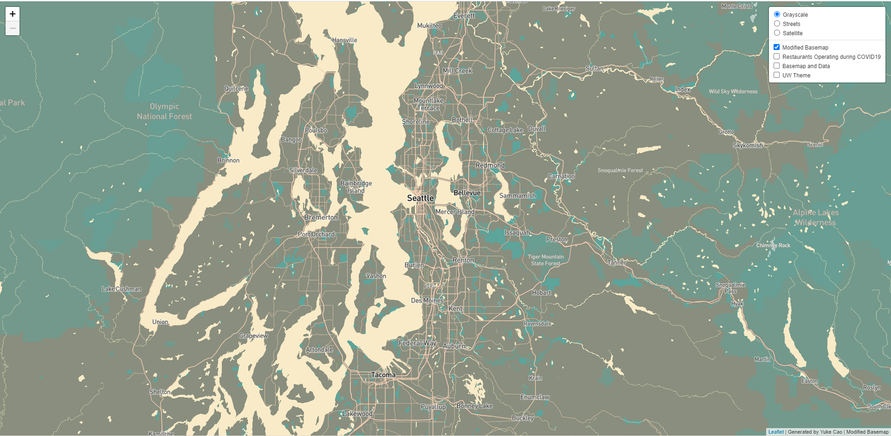
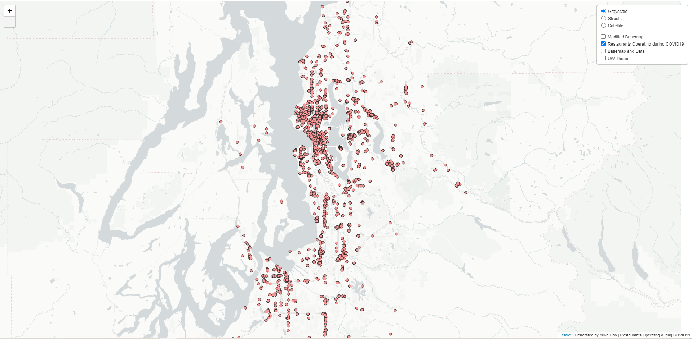
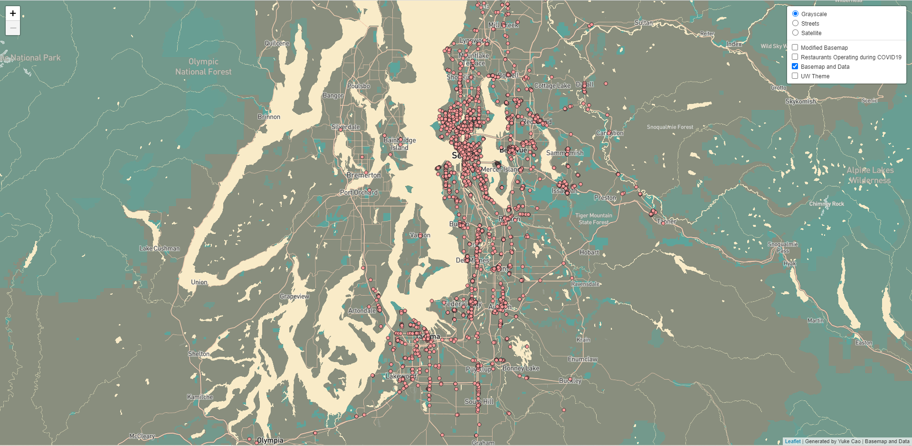

# Map-Design-and-Tile-Generation

Link to hosted webmap: https://tpmccrea.github.io/GEOG458_Lab4/

## Tile 1 Screenshot - Modified Basemap

- Description of Tile: Modified basemap by using mapbox Cartogram. I added Roads, Transits and Place Lables to make preparations for adding restaurants data.
- Geographic Area of Focus: Seattle, WA and surrounding municipalities
- Zoom Levels: Max Zoom - 14; Min Zoom - 10

## Tile 2 Screenshot - Map Data (Restaurants Operating during COVID19, Seattle)

- Description of Tile: Data layer showing the location of restaurants operating during COVID19 in seattle area.
- Geographic Area of Focus: Seattle, WA
- Zoom Levels: Max Zoom - 14; Min Zoom - 10

## Tile 3 Screenshot - Basemap and Data

- Description of Tile: Tile utilizing the modified basemap from Tile 1 & the map data from Tile 2
- Geographic Area of Focus: Seattle, WA and surrounding municipalities
- Zoom Levels: Max Zoom - 14; Min Zoom - 10

## Tile 4 Screenshot - UW Style Roadmap

- Description of Tile: Map tile made using the color scheme from UW to highlight the characteristics of UW.
- Geographic Area of Focus: Seattle, WA and surrounding municipalities
- Zoom Levels: Max Zoom - 14; Min Zoom - 10
